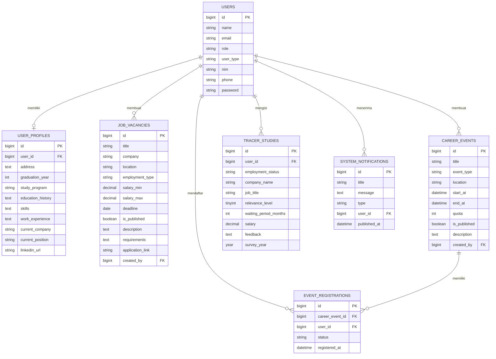

# ERD Sistem Manajemen Alumni

```mermaid
erDiagram
    USERS ||--o| USER_PROFILES : memiliki
    USERS ||--o{ JOB_VACANCIES : membuat
    USERS ||--o{ CAREER_EVENTS : membuat
    USERS ||--o{ EVENT_REGISTRATIONS : mendaftar
    USERS ||--o{ TRACER_STUDIES : mengisi
    USERS ||--o{ SYSTEM_NOTIFICATIONS : menerima
    CAREER_EVENTS ||--o{ EVENT_REGISTRATIONS : memiliki

    USERS {
        bigint id PK
        string name
        string email
        string role
        string user_type
        string nim
        string phone
        string password
    }

    USER_PROFILES {
        bigint id PK
        bigint user_id FK
        text address
        int graduation_year
        string study_program
        text education_history
        text skills
        text work_experience
        string current_company
        string current_position
        string linkedin_url
    }

    JOB_VACANCIES {
        bigint id PK
        string title
        string company
        string location
        string employment_type
        decimal salary_min
        decimal salary_max
        date deadline
        boolean is_published
        text description
        text requirements
        string application_link
        bigint created_by FK
    }

    CAREER_EVENTS {
        bigint id PK
        string title
        string event_type
        string location
        datetime start_at
        datetime end_at
        int quota
        boolean is_published
        text description
        bigint created_by FK
    }

    EVENT_REGISTRATIONS {
        bigint id PK
        bigint career_event_id FK
        bigint user_id FK
        string status
        datetime registered_at
    }

    TRACER_STUDIES {
        bigint id PK
        bigint user_id FK
        string employment_status
        string company_name
        string job_title
        tinyint relevance_level
        int waiting_period_months
        decimal salary
        text feedback
        year survey_year
    }

    SYSTEM_NOTIFICATIONS {
        bigint id PK
        string title
        text message
        string type
        bigint user_id FK
        datetime published_at
    }
```
